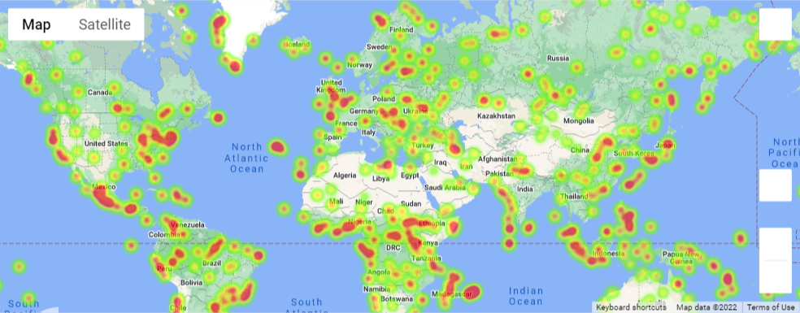
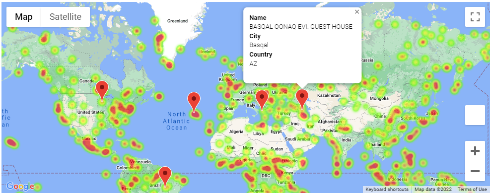

# What's the Weather Like?

## Background

Whether financial, political, or social&mdash;data's true power rests in its ability to answer questions definitively. So, we will be using Python requests, APIs, and JSON traversals to answer a fundamental question: "What's the weather like as we approach the equator?"

Now, we know what you may be thinking: _"Duh. It gets hotter ..."_

But, if pressed, how would you **prove** it?

## Part 1: WeatherPy

We'll create a Python script to visualize the weather of 500+ cities of varying distance from the equator. To do so, we'll use a [simple Python library](https://pypi.python.org/pypi/citipy), the [OpenWeatherMap API](https://openweathermap.org/api), and create a representative model of weather across cities.

First we will create a series of scatter plots to showcase the following relationships:

* Temperature (F) vs. Latitude
* Humidity (%) vs. Latitude
* Cloudiness (%) vs. Latitude
* Wind Speed (mph) vs. Latitude

For further analysis we'll compute the linear regression for each relationship. This time, we'll separate the plots into Northern Hemisphere (greater than or equal to 0 degrees latitude) and Southern Hemisphere (less than 0 degrees latitude):

* Northern Hemisphere - Temperature (F) vs. Latitude
* Southern Hemisphere - Temperature (F) vs. Latitude
* Northern Hemisphere - Humidity (%) vs. Latitude
* Southern Hemisphere - Humidity (%) vs. Latitude
* Northern Hemisphere - Cloudiness (%) vs. Latitude
* Southern Hemisphere - Cloudiness (%) vs. Latitude
* Northern Hemisphere - Wind Speed (mph) vs. Latitude
* Southern Hemisphere - Wind Speed (mph) vs. Latitude

The final [notebook WeatherPy](starter_code/WeatherPy.ipynb) computes the following:

* Randomly selects **at least** 500 unique (non-repeated) cities based on latitude and longitude.
* Performs a weather check on each of the cities using a series of successive API calls.
* Includes a print log of each city as it's being processed, with the city number and city name.
* Saves a CSV of all retrieved data and a PNG image for each scatter plot.

## Part 2: VacationPy

Now, using weather data we'll plan future vacations. Using Jupyter-gmaps and the Google Places API for this part.

In this section, we'll do the following:

* Create a heat map that displays the humidity for every city from Part 1:

  

* Now we'll narrow down the DataFrame to find your ideal weather condition, as following:

  * A max temperature lower than 75 degrees but higher than 70.

  * Wind speed less than 10 mph.

  * Zero cloudiness.

  * We'll drop any rows that don't satisfy all three conditions. To make sure the weather is ideal.

* Using Google Places API we'll find the first hotel for each city located within 5,000 meters of the coordinates.

* Then we'll plot the hotels on top of the humidity heatmap, with each pin containing the **Hotel Name**, **City**, and **Country**, image below:

  

## What you will need to successfully run this code

* Google API key for [Google Places API and Gmaps](https://developers.google.com/maps/documentation/places/web-service/overview)
* Weather API for [openweathermap](https://openweathermap.org/api)
